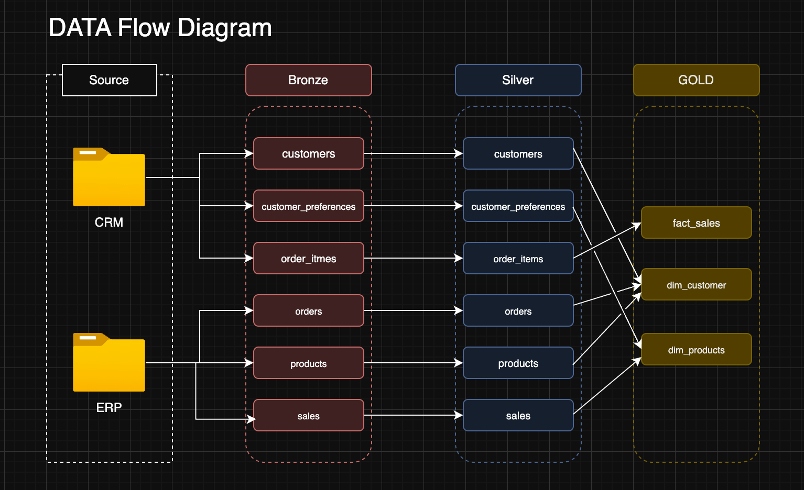
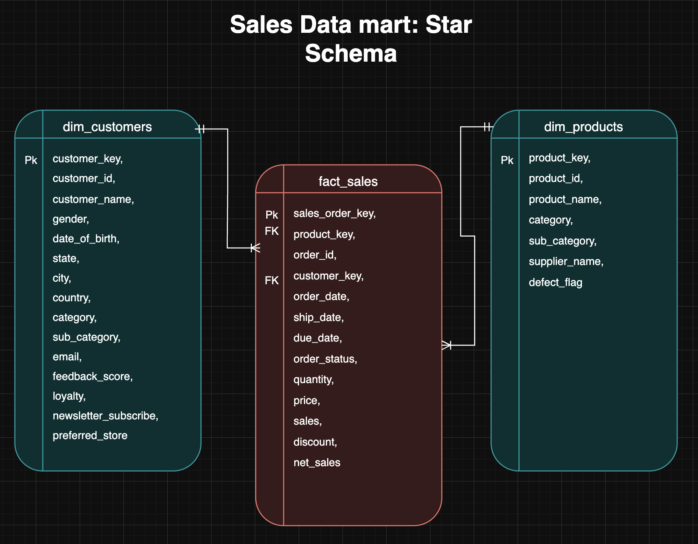
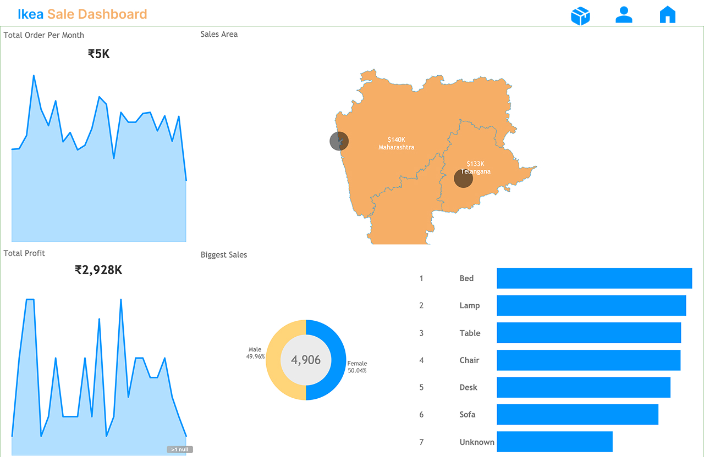

**🛠️ Skills & Technologies Used**

       

# 🏠 <u>Ikea Data Warehouse</u>

This repository showcases a comprehensive data warehousing and analytics solution, covering the end-to-end data pipeline—from data ingestion and transformation to business intelligence and insights generation.

Designed as a portfolio project, it demonstrates industry best practices in data engineering, ETL processes, and analytical modeling, enabling efficient data-driven decision-making. This project serves as a blueprint for building a scalable and structured data warehouse architecture that supports business intelligence and reporting.

---

## ⚙️ Data Architect

Basic Data Architect used for this project to build Bronze, Silver, and Gold layers.


1. **Bronze Layer**: The raw data storage layer, where data is ingested directly from source systems (e.g., CSV files) into the **SQL Server database** without modifications. This layer acts as a **staging area**, preserving the original data for historical reference and traceability.
2. **Silver Layer**: The data transformation layer, where raw data undergoes **cleansing, standardization, and normalization** to ensure consistency, accuracy, and integrity, making it suitable for deeper analysis.
3. **Gold Layer**: The business-ready layer, where data is **modeled into a structured star schema**, optimized for **reporting, analytics, and decision-making**.

---

## 📖 Project Overview

This project involves:

- **Data Architecture**: Designing a Modern Data Warehouse using the Medallion Architecture (**Bronze**, **Silver**, and **Gold** layers).
- **ETL Pipelines**: Extracting, transforming, and loading data from source systems into the warehouse.
- **Data Modeling**: Developing fact and dimension tables optimized for analytical queries.
- **Analytics & Reporting**: Creating SQL-based reports and dashboards for actionable insights.

This repository is an excellent resource for professionals and students looking to showcase expertise in:

- SQL Development
- Data Architecture
- Data Engineering
- ETL Pipeline Development
- Data Modeling
- Data Analytics

---

## 🚀 Project Requirements

### 🧱 Building the Data Warehouse (Data Engineering)

**Objective**  
Develop a modern data warehouse using SQL Server to consolidate sales data, enabling analytical reporting and informed decision-making.

**Specifications**

- **Data Sources**: Import data from two source systems (ERP and CRM) provided as CSV files.
- **Data Quality**: Cleanse and resolve data quality issues prior to analysis.
- **Integration**: Combine both sources into a single, user-friendly data model designed for analytical queries.
- **Scope**: Focus on the latest dataset only; historization of data is not required.
- **Documentation**: Provide clear documentation of the data model to support both business stakeholders and analytics teams.

---

## ⚙️ ETL (Extract Transform and Load)

The ETL process is the backbone of this data warehouse project, ensuring seamless data ingestion, transformation, and integration from multiple sources into a structured analytical model. This project follows a layered Medallion Architecture (Bronze, Silver, Gold) to progressively refine raw data into a business-ready format for reporting and analytics.

---

## 🧰 Project Planning

- **draw.io** (for ERD and Architecture Diagrams)  
  
- **draw.io** Data mart
  

---

## 📈 BI: Analytics & Reporting (Data Analysis)

**Objective**  
Develop SQL-based analytics to deliver detailed insights into:

- **Total Order**
- **Total Profits**
- **Region Sales**
- **Sales Trends**
  

These insights empower stakeholders with key business metrics, enabling strategic decision-making.
## ➡️ Key Findings
📊 Insights Delivered
• Monthly Orders: 5,000+
• Total Sales: $2.93M/year
• Avg. Monthly Order Value: $4,906
• Top Customer States: Maharashtra, Telangana, Tamil Nadu
• High Demand Products: Beds, Lamps, Office Furniture, Living Room Sets

---

## 🔎 Exploratory Data Analysis (EDA)

This section includes powerful SQL queries to extract actionable insights from the **Gold Layer** tables: `dim_customers`, `dim_products`, and `fact_sales`.

---

### 👤 Customer Insights

**1. Schema Check**

```sql

SELECT table_name
FROM information_schema.tables
WHERE table_schema = 'gold' AND table_type = 'BASE TABLE';

SELECT
  column_name,
  data_type,
  is_nullable
FROM information_schema.columns
WHERE table_schema = 'gold'
  AND table_name = 'your_table_name';

SELECT 'dim_customers' AS table_name, COUNT(*) FROM gold.dim_customers
UNION ALL
SELECT 'dim_products', COUNT(*) FROM gold.dim_products
UNION ALL
SELECT 'fact_sales', COUNT(*) FROM gold.fact_sales;
```

**2. Gold.dim_customers Table Check**

```sql
SELECT gender, COUNT(*) FROM gold.dim_customers GROUP BY gender;

SELECT DATE_PART('year', AGE(date_of_birth)) AS age, COUNT(*)
FROM gold.dim_customers
GROUP BY age ORDER BY age;

SELECT preferred_store, COUNT(*)
FROM gold.dim_customers
GROUP BY preferred_store
ORDER BY COUNT(*) DESC;
```

**3. Gold.dim_products Table Check**

```sql
SELECT category, COUNT(*)
FROM gold.dim_products
GROUP BY category ORDER BY COUNT(*) DESC;

SELECT defect_flag, COUNT(*)
FROM gold.dim_products
GROUP BY defect_flag;

SELECT supplier_name, COUNT(*)
FROM gold.dim_products
GROUP BY supplier_name
ORDER BY COUNT(*) DESC
LIMIT 10;
```

**4. Gold.fact_sales Table Check**

```sql
SELECT DATE_TRUNC('month', order_date) AS order_month, COUNT(*)
FROM gold.fact_sales
GROUP BY order_month
ORDER BY order_month;

SELECT
  AVG(ship_date - order_date) AS avg_shipping_days,
  MAX(ship_date - order_date) AS max_shipping_days
FROM gold.fact_sales;

SELECT order_status, SUM(net_sales) AS total_sales
FROM gold.fact_sales
GROUP BY order_status;
```

**5. Health Check**

```sql
SELECT
    conname AS constraint_name,
    conrelid::regclass AS table_from,
    a.attname AS column_from,
    confrelid::regclass AS table_to,
    af.attname AS column_to
FROM   pg_constraint
JOIN   pg_class ON conrelid = pg_class.oid
JOIN   pg_attribute a ON a.attrelid = conrelid AND a.attnum = ANY(conkey)
JOIN   pg_attribute af ON af.attrelid = confrelid AND af.attnum = ANY(confkey)
WHERE  contype = 'f'
AND    pg_class.relnamespace::regnamespace::text = 'gold';
```

## Repository Structure

```cmd
├── assets/                        # Static assets like diagrams or images
│   └── images/
│
├── CSV/                           # All CSV datasets
│   ├── Gold_csv/                  # Final curated data (Gold Layer)
│   │   ├── dim_customers.csv
│   │   ├── dim_products.csv
│   │   └── fact_sales.csv
│   └── Ikea_sale/                # Raw synthetic ERP + CRM datasets
│       ├── customer_preferences.csv
│       ├── customers.csv
│       ├── order_items.csv
│       ├── orders.csv
│       ├── products.csv
│       └── sales.csv
│
├── License                        # Project license (e.g., MIT)
├── Procedures/                    # ETL procedures for data loading
│   ├── bronze_layer_batch.sql
│   ├── main.sql
│   └── silver_layer_batch.sql
│
├── project/
│   └── Business analysis/         # Business logic & insight generation
│       ├── advance_analysis.sql
│       ├── business_analysis.sql
│       └── EDA.sql
│
├── python/                        # Python automation/data generation
│   └── main.py
│
├── readme.md                      # Project documentation
├── requirements.txt               # Python package dependencies
│
├── scripts/                       # DDL scripts to define schema layers
│   ├── ddl_bronze_layer.sql
│   ├── ddl_gold_layer.sql
│   ├── ddl_silver_layer.sql
│   ├── keys_constraint.sql
│   └── main.sql
│
├── tests/                         # Placeholder for test SQLs or checks
│
├── todo.todo                      # Notes or to-do list
│
└── venv/                          # Virtual environment files (excluded from version control)
```

## 🪪 License

This project is licensed under the [MIT License](LICENSE). You are free to use, modify, and share this project with proper attribution.

## About Me

Hi there! I'm Saquib Hazari. With a strong foundation in analytical thinking and data-driven decision-making, I've worked on a range of data science projects, including predictive modeling, ETL pipelines, and data warehousing.

Currently, I focus on:

- Building and optimizing ETL pipelines.
- Working with large-scale databases and performing advanced data analysis.
- Using tools like SQL, Python, and Tableau to extract actionable insights from data.

I enjoy exploring new technologies in machine learning, AI, and deep learning. My approach is hands-on, and I love learning by doing — whether it's building machine learning models or fine-tuning complex data pipelines.

### Current Projects:

- Developing a predictive model to understand customer behavior.
- Implementing an advanced data pipeline to optimize data workflows.
- Working on various marketing analytics projects to drive business decisions.

Feel free to connect or check out my previous projects!
[Data warehouse project](https://github.com/Saquib-Hazari/sql-data-warehouse-project?tab=readme-ov-file)

## Connect with Me

[](https://www.linkedin.com/in/saquib-hazari/) [](https://x.com/saquib7298) [](https://discord.gg/FJBZBbgC) [](<[https://YOUR_WEBSITE.com](https://saquibhazari-portfolio.vercel.app/)>) [](mailto:your-email@gmail.com)
